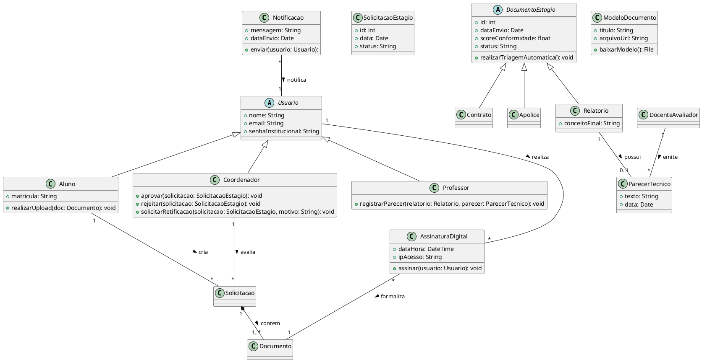

# Diagrama de Classes

## Introdução

O diagrama de classes é o diagrama UML mais usado principalmente por servir como uma ponte entre os requisitos do sistema e a implementanção em código, devido à sua estrutura similar à usada nas principais linguagens de programação com suporte a Orientação a Objeto, como Python e Java.

Além disso, o diagrama de classes funciona como uma representação visual geral de como o código do sistema vai ser implementado, como veremos no diagrama a seguir.

---

## Mapeamento das Classes do Sistema

---
