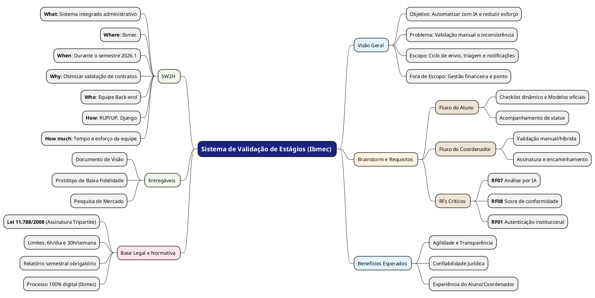

 
## Introdução
 

Mapa mental consiste em criar resumos cheios de símbolos, cores, setas e frases de efeito com o objetivo de organizar o conteúdo e facilitar associações entre as informações destacadas. Esse material é muito indicado para pessoas que têm facilidade de aprender de forma visual.

 
## Metodologia
 

Usamos o mapa mental para demonstrar o que foi feito até agora (Pesquisas de legislação, quais metodologias foram usadas, definição do nosso 5W2H) e para representar o que deve ser feito em relação ao software e o porquê cada coisa deve ser feita. Usamos PlantUML pela facilidade de integração ao MkDocs e pela qualidade de representação do mapa mental.

 
## Mapa mental:

## Conclusão
 

Com esse mapa mental montado, sabemos o caminho a ser seguido e quais direções o projeto deve tomar.

 
## Referências

> PlantUML para Mapas Mentais. Disponível em: https://plantuml.com/mindmap-diagram

## Versionamento
| Data | Versão | Descrição | Autor(es) |
| -- | -- | -- | -- |
| 09/04/2026 | 1.0 | Criação de documento | Bruno Norton, Christian Werneck, Gianluca Leonardi, Marcos Paulo Assunção, Maurício Gomes e Micael Dali |

