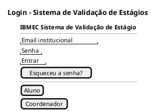
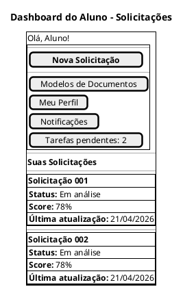
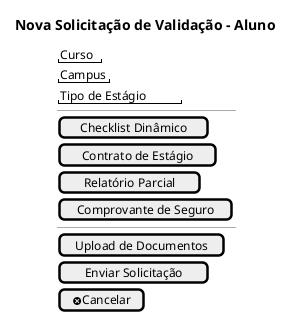
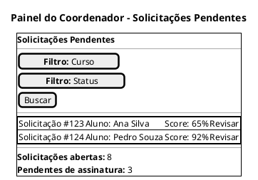
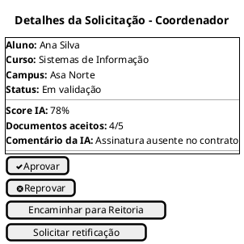
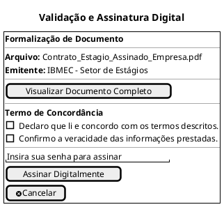
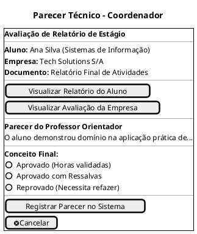

## Introdução

A construção do protótipo de alta fidelidade auxilia a equipe de desenvolvimento a encontrar um nível de detalhes abrangentes, extrair funcionalidades, testar usabilidade, e também fornece uma base para o gerenciamento do projeto pois com o protótipo é possível realizar estimativas de quanto tempo será necessário desempenhar em cada funcionalidade.

## Metodologia

Iniciamos o projeto através dos levantamentos iniciais da equipe, após discussões a ferramenta Figma foi selecionada para produzir o protótipo de alta fidelidade com auxílio do Material Design Color Tool.

## Protótipo de baixa fidelidade

Este protótipo de baixa fidelidade descreve a experiência básica da aplicação "Sistema de Validação de Estágios" para os dois perfis identificados: aluno e coordenador. O foco está em validar fluxo de login, abertura de solicitação, upload de documentos, acompanhamento de status e análise de conformidade com apoio de IA.

### Telas necessárias

- **Login institucional**: acesso restrito a e-mail @ibmec e discriminação de perfis Aluno ou Coordenador.
- **Dashboard do Aluno**: visão das solicitações abertas, status e notificações de validação.
- **Nova Solicitação**: formulário com seleção de curso/campus, checklist dinâmico e upload de documentos, além de links para modelos oficiais.
- **Painel do Coordenador**: lista de solicitações pendentes, filtro por curso/status e resumo de workload.
- **Detalhes da Solicitação**: painel de análise com score da IA, documentos enviados, comentários e ações de validação/assinatura.
- **Assinatura Digital / Termo de Aceite**: tela onde alunos e coordenadores podem assinar e concordar com termos dos documentos recebidos por eles.
- **Parecer Final do Coordenador**: onde o coordenador visualiza o relatório do aluno, a avaliação da empresa e o parecer do professor orientador e aprova ou não o aluno.

### PlantUML Salt - Login institucional

### PlantUML Salt - Dashboard do Aluno

### PlantUML Salt - Formulário de Nova Solicitação

### PlantUML Salt - Painel do Coordenador

### PlantUML Salt - Detalhes da Solicitação para Validação

### PlantUML Salt - Assinatura Digital / Termo de Aceite

### Parecer Final - Coordenador

## Conclusão

A partir da elaboração do protótipo foi possível ter uma noção inicial da interface do usuário, definindo telas, fluxo e algumas funcionalidades.

## Referências

> Ferramenta PlantUML para Criação de Prtotótipos. Disponível em https://plantuml.com/salt

## Autor(es)

| Data     | Versão | Descrição                            | Autor(es)                                                                           |
| -------- | ------ | ------------------------------------ | ----------------------------------------------------------------------------------- |
| 10/04/2026 | 1.0    | Criação de documento | Bruno Norton, Christian Werneck, Gianluca Leonardi, Marcos Paulo Assunção, Maurício Gomes e Micael Dali |